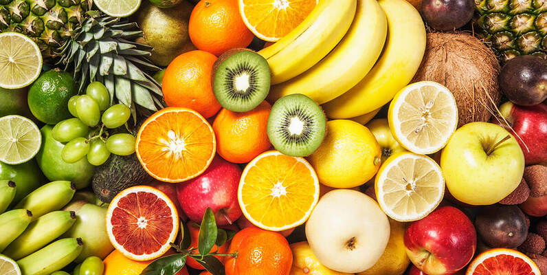

<h1>Fruit Classifier with Convolutional Neural Networks</h1>

<!-- Imagen de portada -->

This project aims to develop an image classifier for fruits using convolutional neural networks (CNN). The model leverages a <strong>pretrained ResNet50</strong> architecture, which is fine-tuned to classify different types of fruits. The model is designed to identify the following fruits:

<ul>
    <li>Apple</li>
    <li>Banana</li>
    <li>Avocado</li>
    <li>Cherry</li>
    <li>Kiwi</li>
    <li>Mango</li>
    <li>Orange</li>
    <li>Pineapple</li>
    <li>Strawberry</li>
    <li>Watermelon</li>
</ul>

The ResNet50 model was selected for its depth and efficiency, and it has been trained on default heights to ensure optimal performance in fruit classification tasks.

<h2>Project Structure</h2>

The structure of the project is as follows:

<pre>
fruits_classifier/
├── MY_data/                # Directory containing training and test data
│   ├── predict/            # Directory for predictions
│   ├── test/               # Test images organized in folders by class
│   │   ├── apple
│   │   ├── avocado
│   │   ├── banana
│   │   ├── cherry
│   │   ├── kiwi
│   │   ├── mango
│   │   ├── orange
│   │   ├── pineapple
│   │   ├── strawberries
│   │   └── watermelon
│   └── train/              # Training images organized in folders by class
│       ├── apple
│       ├── avocado
│       ├── banana
│       ├── cherry
│       ├── kiwi
│       ├── mango
│       ├── orange
│       ├── pineapple
│       ├── strawberries
│       └── watermelon
├── main.ipynb              # Jupyter Notebook for training and evaluation
├── requirements.txt        # Project dependencies
└── README.md               # This file
</pre>

<h2>Installation</h2>

To install the project dependencies, run:

<pre>
pip install -r requirements.txt
</pre>

<h2>Download Images</h2>

Before running the project, you need to download the fruit images. The dataset can be accessed through the link below:

    <a href="https://drive.google.com/drive/folders/1ru2np2wMl27f1kRUfR7fnXRDadi3o525?usp=drive_link" target="_blank" style="text-decoration: none; color: #ffffff; background-color: #007bff; padding: 10px 15px; border-radius: 5px;">Download Fruit Images</a>

After downloading, extract the images into the <strong>MY_data</strong> directory, maintaining the folder structure for training and testing.

<h2>Usage</h2>

To train the model, run the Jupyter Notebook:

<pre>
jupyter notebook main.ipynb
</pre>

Make sure to execute the cells line by line, as the notebook is designed to guide you through the process step by step.

<h2>Testing with Images from the Web</h2>

You can test the model with any image from the Internet by providing its URL. Below is an example of how to do this using Python:

<pre>
# (Código omitido para cargar imágenes desde la URL)
</pre>

Replace the <code>url</code> variable with the URL of the image you want to classify. The model will load the image, process it, and display the prediction.

<h2>Training Loss and Accuracy Graphs</h2>

During the training process, it is crucial to monitor the loss and accuracy to evaluate the model's performance. The following graphs will be generated:

<ul>
    <li><strong>Training and Validation Loss:</strong> This graph shows the loss values for both the training and validation datasets over each epoch. A decreasing trend in both curves indicates that the model is learning. If the training loss decreases while the validation loss starts to increase, it may suggest overfitting.</li>
    <li><strong>Training and Validation Accuracy:</strong> This graph depicts the accuracy for the training and validation datasets over each epoch. An increasing trend in both curves indicates that the model is improving its classification performance. Ideally, both curves should converge towards a high accuracy value.</li>
</ul>

<!-- Imagen de ejemplo para la gráfica de pérdida -->

<!-- Imagen de ejemplo para la gráfica de precisión -->

<h2>Confusion Matrix</h2>

The confusion matrix provides a comprehensive overview of the model's performance, illustrating the true positive, false positive, true negative, and false negative predictions for each class. This allows for an easy evaluation of how well the model is classifying each fruit type.

<!-- Imagen de ejemplo para la matriz de confusión -->

