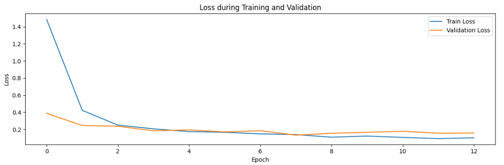
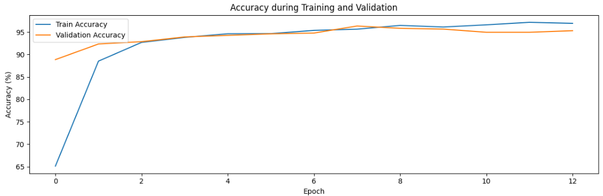
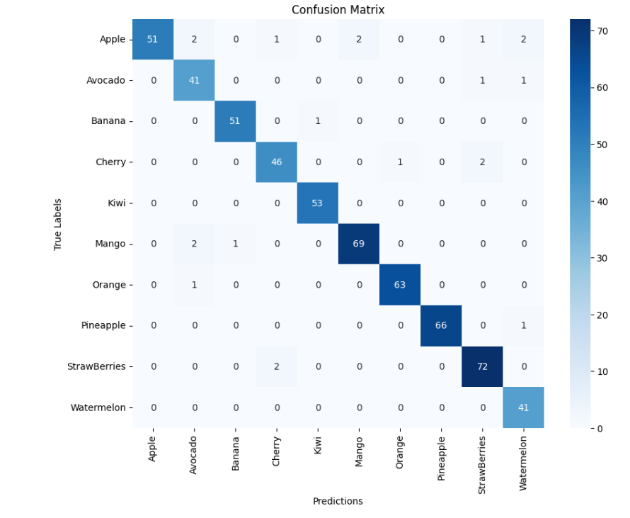

<h1>Fruit Classifier with Convolutional Neural Networks</h1>

<!-- Imagen de portada -->

This project aims to develop an image classifier for fruits using convolutional neural networks (CNN). The model leverages a <strong>pretrained ResNet50</strong> architecture, which is fine-tuned to classify different types of fruits. The model is designed to identify the following fruits:

<ul>
    <li>Apple</li>
    <li>Banana</li>
    <li>Avocado</li>
    <li>Cherry</li>
    <li>Kiwi</li>
    <li>Mango</li>
    <li>Orange</li>
    <li>Pineapple</li>
    <li>Strawberry</li>
    <li>Watermelon</li>
</ul>

The ResNet50 model was selected for its depth and efficiency, and it has been trained on default heights to ensure optimal performance in fruit classification tasks.

<h2>Project Structure</h2>

The structure of the project is as follows:

<pre>
fruits_classifier/
├── MY_data/                # Directory containing training and test data
│   ├── predict/            # Directory for predictions
│   ├── test/               # Test images organized in folders by class
│   │   ├── apple
│   │   ├── avocado
│   │   ├── banana
│   │   ├── cherry
│   │   ├── kiwi
│   │   ├── mango
│   │   ├── orange
│   │   ├── pineapple
│   │   ├── strawberries
│   │   └── watermelon
│   └── train/              # Training images organized in folders by class
│       ├── apple
│       ├── avocado
│       ├── banana
│       ├── cherry
│       ├── kiwi
│       ├── mango
│       ├── orange
│       ├── pineapple
│       ├── strawberries
│       └── watermelon
├── main.ipynb              # Jupyter Notebook for training and evaluation
├── requirements.txt        # Project dependencies
└── README.md               # This file
</pre>

<h2>Installation</h2>

To install the project dependencies, run:

<pre>
pip install -r requirements.txt
</pre>

<h2>Download Images</h2>

Before running the project, you need to download the fruit images. The dataset can be accessed through the link below:

    <a href="https://drive.google.com/drive/folders/1ru2np2wMl27f1kRUfR7fnXRDadi3o525?usp=drive_link" target="_blank" style="text-decoration: none; color: #ffffff; background-color: #007bff; padding: 10px 15px; border-radius: 5px;">Download Fruit Images</a>

After downloading, extract the images into the <strong>MY_data</strong> directory, maintaining the folder structure for training and testing.

<h2>Usage</h2>

To train the model, run the Jupyter Notebook:

<pre>
jupyter notebook main.ipynb
</pre>

Make sure to execute the cells line by line, as the notebook is designed to guide you through the process step by step.

<h2>Training Loss and Accuracy Graphs</h2>

During the training process, it is crucial to monitor the loss and accuracy to evaluate the model's performance. The following graphs will be generated:

<strong>Upper Graph: Loss during Training and Validation</strong>

<ul>
    <li>This graph shows the model's loss over epochs for both the training and validation sets.</li>
    <li>The blue line represents the loss during training, while the orange line represents the loss in validation.</li>
</ul>

In the early epochs, loss in training decreases rapidly, which is a good sign that the model is learning from the data. From the fourth epoch, both training and validation loss are stabilized, indicating that the model has reached a point where performance does not improve significantly.

<strong>Lower Graph: Accuracy during Training and Validation</strong>

<ul>
    <li>This graph shows the model's accuracy on the training and validation sets across epochs.</li>
    <li>The blue line represents the accuracy during training, while the orange line represents the accuracy in validation.</li>
</ul>

Accuracy in both sets (training and validation) increases significantly in the early epochs, indicating that the model is improving rapidly. However, after a certain point, both training and validation accuracies seem to stabilize, suggesting that the model has reached its maximum generalization capacity for both the validation and training data.

In conclusion, the model performs well in both training and validation. The loss decreases rapidly, and the accuracy increases steadily.

<h2>Confusion Matrix</h2>

A <strong>confusion matrix</strong> is a table used to evaluate the performance of a classification model. Each row represents the actual class, while each column represents the predicted class. The values in the cells indicate how many instances were classified into the corresponding predicted class.

<ul>
    <li><strong>Diagonal elements:</strong> These represent the number of correct predictions for each class. For example, the cell at (Apple, Apple) shows 51, which means that 51 instances of the "Apple" class were correctly predicted as "Apple."</li>
    <li><strong>Elements outside the diagonal:</strong> These represent misclassifications. For example, the cell at (Apple, Avocado) shows 2, which means that 2 instance of the "Apple" class was incorrectly classified as "Avocado."</li>
<ul>

